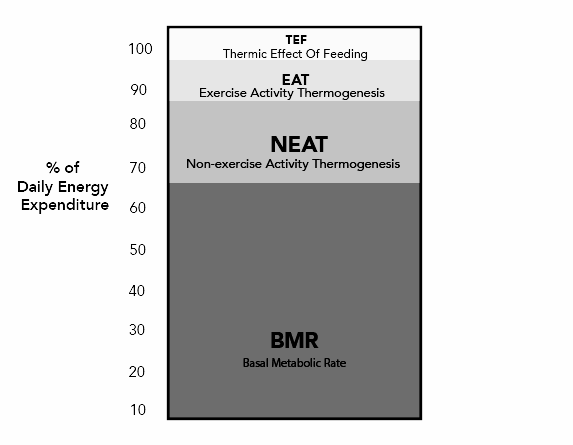

Le TDEE (Total Daily Energy Expenditure) est le total des calories brûlées en 24h. Comprendre ses composantes — et leur part de variabilité — est le point de départ de toute nutrition réellement calibrée.

## Composantes du TDEE

- **Basal Metabolic Rate (BMR)** : Calories nécessaires au fonctionnement vital (respiration, circulation, thermorégulation). Représente **60-75%** du TDEE. Relativement stable d'un jour à l'autre pour un même individu.
- **Thermic Effect Of Feeding (TEF)** : Énergie dépensée pour digérer et métaboliser les aliments. Environ **8-15%** du TDEE, avec un coût nettement plus élevé pour les protéines (20-30%) que pour les glucides (5-10%) ou les lipides (0-3%).
- **Exercise Activity Thermogenesis (EAT)** : Entraînements structurés. Représente **5%** chez le sédentaire, jusqu'à **20%** chez l'athlète.
- **Non-Exercise Activity Thermogenesis (NEAT)** : Toutes les activités spontanées du quotidien. Variable de **5 à 50%** selon le mode de vie.

## La NEAT : la variable clé

La NEAT est la composante la plus modifiable du TDEE. Elle dépend de :

- Type d'emploi (travail physique vs. bureau)
- Mobilité quotidienne (pas, escaliers, transports actifs)
- Prédispositions individuelles (certaines personnes bougent spontanément plus)
- Habitudes domestiques (ménage, bricolage, jardinage)

Des individus au profil similaire peuvent afficher une NEAT différant de plusieurs centaines à plus de 2 000 kcal/jour selon leur mode de vie (Levine, 2002).

### Rôle dans la régulation du poids

La NEAT est l'un des mécanismes clés de résistance au gain de masse grasse lors d'un surplus calorique. Cette capacité d'adaptation varie individuellement, expliquant pourquoi certains prennent du poids plus facilement que d'autres. En contexte de déficit prolongé, la NEAT tend à diminuer spontanément (thermogenèse adaptative, Müller & Bosy-Westphal, 2013) — un mécanisme à compenser activement en maintenant un niveau de marche quotidien stable. Une NEAT élevée est associée à une meilleure composition corporelle et une réduction des risques cardio-métaboliques.

### Application pour la force et l'hypertrophie

- **Dépense sans interférence** : Contrairement au cardio intensif, la NEAT n'induit ni fatigue nerveuse excessive, ni stress articulaire, ni interférence avec les adaptations musculaires.
- **Recomposition corporelle** : Maintenir un niveau de marche quotidien élevé permet de consommer davantage de calories tout en préservant un taux de masse grasse bas, sans empiéter sur la récupération.
- **Récupération active** : Favorise la circulation sanguine et le transport des nutriments vers les tissus musculaires sans générer de fatigue supplémentaire.

---

## Estimer son TDEE



---

## Références

- Levine JA. (2002). *Non-exercise activity thermogenesis (NEAT)*. Best Practice & Research Clinical Endocrinology & Metabolism.
- Pontzer H. et al. (2021). *Daily energy expenditure through the human life course*. Science.
- Müller MJ, Bosy-Westphal A. (2013). *Adaptive thermogenesis with weight loss in humans*. Obesity.
- Westerterp KR. (2004). *Diet induced thermogenesis*. Nutrition & Metabolism.
- Mifflin MD et al. (1990). *A new predictive equation for resting energy expenditure in healthy individuals*. American Journal of Clinical Nutrition.
- Ainsworth BE et al. (2011). *2011 Compendium of Physical Activities*. Medicine & Science in Sports & Exercise.
- Helms ER et al. (2014). *Evidence-based recommendations for natural bodybuilding contest preparation: nutrition and supplementation*. Journal of the International Society of Sports Nutrition.
- Morton RW et al. (2018). *A systematic review, meta-analysis and meta-regression of the effect of protein supplementation on resistance training-induced gains in muscle mass and strength*. British Journal of Sports Medicine.
